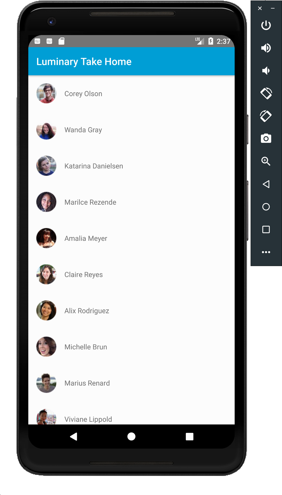

## Assignment
You are given an endpoint (https://randomuser.me/api/?page=1&results=15), which contains several random generated users.

The requirements for the application are the following:
* When the app starts, check a if there is a list of cached users. If there is, return the cache list.
* If there is no users in cache, hit the endpoint, fetch the users, store them in a Database as Cache, and return the list as a result.
* Once the system gets a list of users, Display a list of the users in a recycler view.
* The Display should consist of the user display image as a circle followed by the users first and last name.
* If the app is force closed, upon open, the recycler view loads the data from the Database cache.
* If the user pulls the recycler view, the cache will be cleared and the system will hit the endpoint to get new data.

This project contains basic scaffolding. Consider this project a showcase of your engineering expertise.

You are expected to use the following patterns:
* Dependency Injection
* Reactive data flows (i.e RxJava, Flow, Live Data)

Third party libraries are allowed in all contexts. System libraries are fine to use everywhere.

The length of time spent to finish this exercise will not be included as part of the evaluation. Architecture, style, clarity, overall approach and strategy will be evaluated.

  

